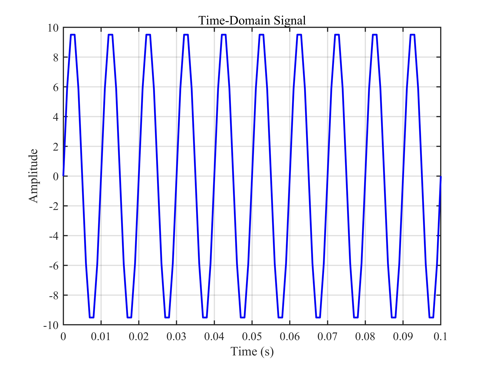
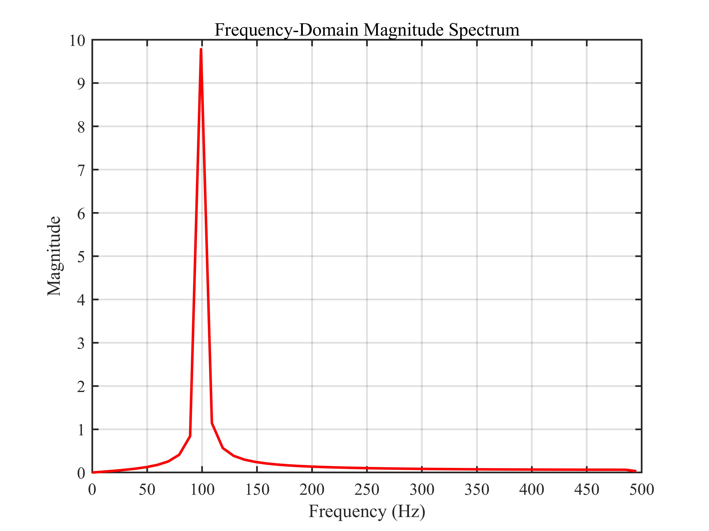

# 快速傅里叶变换时域与频域分析 / Fast Fourier Transform (FFT) Time-Frequency Analysis

## 1. 原理概述 / Principle

快速傅里叶变换（FFT）是离散傅里叶变换（DFT）的高效算法实现，用于将时域信号转换到频域，揭示信号的频率成分。本仿真以一个 100 Hz 正弦信号为例，演示 FFT 的正确用法，包括采样频率计算、幅度谱归一化、单边谱构造和频率轴生成。

The Fast Fourier Transform (FFT) is an efficient algorithm for computing the Discrete Fourier Transform (DFT), converting time-domain signals to the frequency domain to reveal their frequency components. This simulation uses a 100 Hz sine wave as an example to demonstrate proper FFT usage, including sampling frequency calculation, magnitude spectrum normalization, single-sided spectrum construction, and frequency axis generation.

### 核心公式 / Core Equations

**离散傅里叶变换 / Discrete Fourier Transform (DFT):**

$$
X[k] = \sum_{n=0}^{N-1} x[n] \cdot e^{-j 2\pi k n / N}, \quad k = 0, 1, \dots, N-1
$$

**频率分辨率 / Frequency Resolution:**

$$
\Delta f = \frac{f_s}{N}
$$

其中 $f_s$ 为采样频率，$N$ 为采样点数。

where $f_s$ is the sampling frequency and $N$ is the number of samples.

**单边幅度谱构造 / Single-Sided Spectrum Construction:**

$$
|X_{\text{single}}[k]| = \begin{cases}
\dfrac{|X[k]|}{N}, & k = 0 \\
\dfrac{2|X[k]|}{N}, & k = 1, 2, \dots, \dfrac{N}{2} - 1 \\
\dfrac{|X[k]|}{N}, & k = \dfrac{N}{2}
\end{cases}
$$

直流分量不加倍，其余频率分量加倍以补偿双边谱中丢失的能量。

The DC component is not doubled; all other frequency components are doubled to compensate for the energy lost in the two-sided spectrum.

**频率轴 / Frequency Axis:**

$$
f_k = \frac{k \cdot f_s}{N}, \quad k = 0, 1, \dots, \left\lfloor\frac{N}{2}\right\rfloor
$$

---

## 2. 关键参数 / Key Parameters

| 参数 / Parameter | 符号 / Symbol | 值 / Value | 说明 / Description |
|------|------|------|------|
| 信号幅度 | $A$ | 10 | 正弦波幅度 / Sine wave amplitude |
| 信号频率 | $f$ | 100 Hz | 正弦波频率 / Sine wave frequency |
| 采样点数 | $N$ | 101 | 时域采样点数 / Number of time-domain samples |
| 时间范围 | $t$ | 0 ~ 0.1 s | 时域采样区间 / Time sampling interval |

---

## 3. 仿真结果 / Simulation Results

### 3.1 时域信号 / Time-Domain Signal

> 100 Hz 正弦信号，幅度 10，采样 101 个点，时长 0.1 s
>
> 100 Hz sine wave, amplitude 10, 101 samples, 0.1 s duration

### 3.2 频域幅度谱 / Frequency-Domain Magnitude Spectrum

> 单边幅度谱，100 Hz 处峰值幅度为 10（与信号幅度一致）
>
> Single-sided magnitude spectrum, peak at 100 Hz with magnitude 10 (matching the signal amplitude)

---

*更多项目请返回 [F:\GitHub](../../README.md).*
