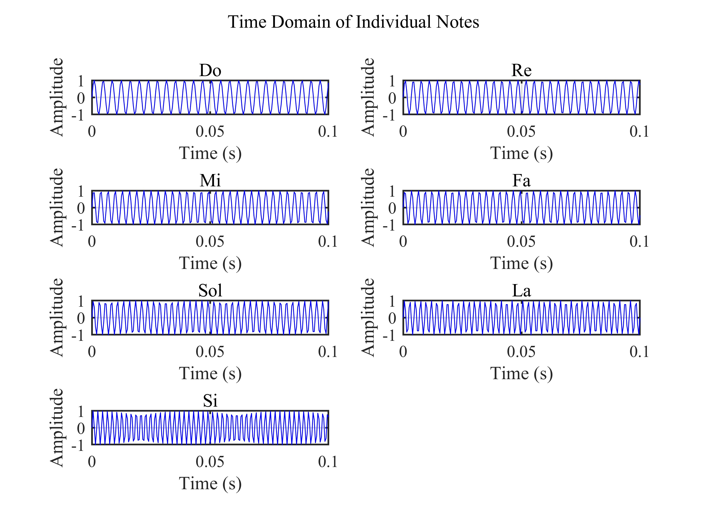
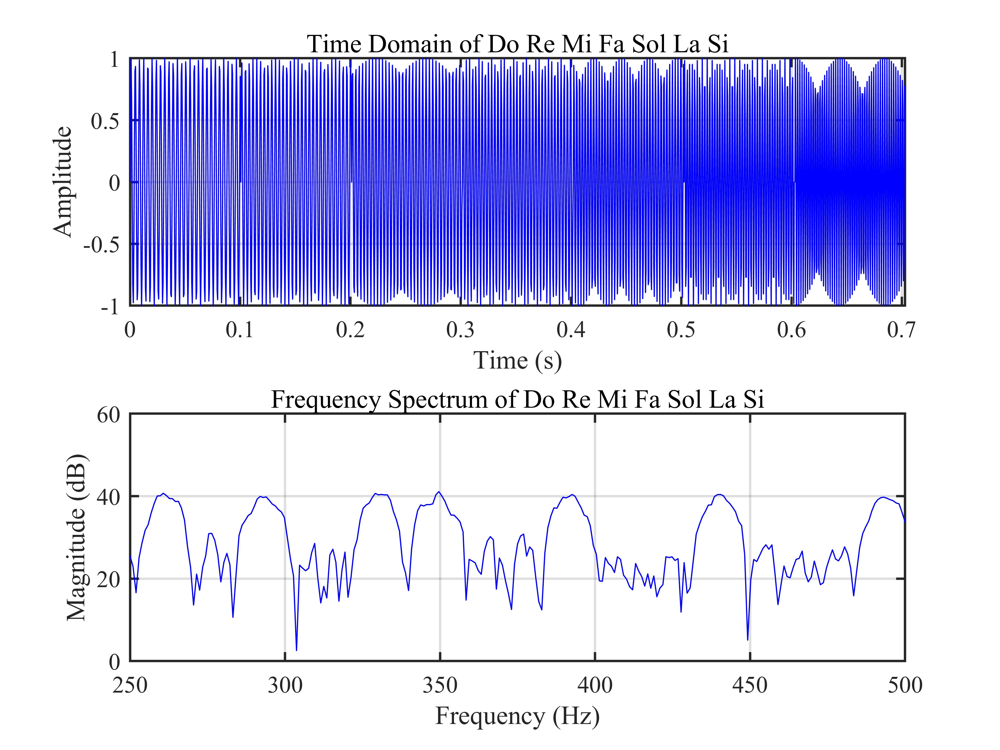
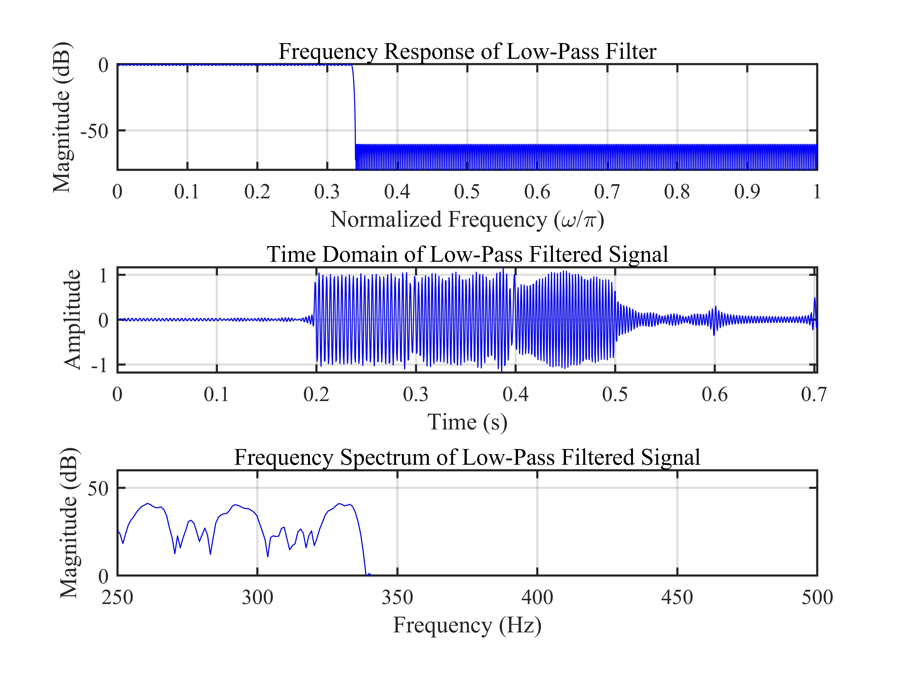
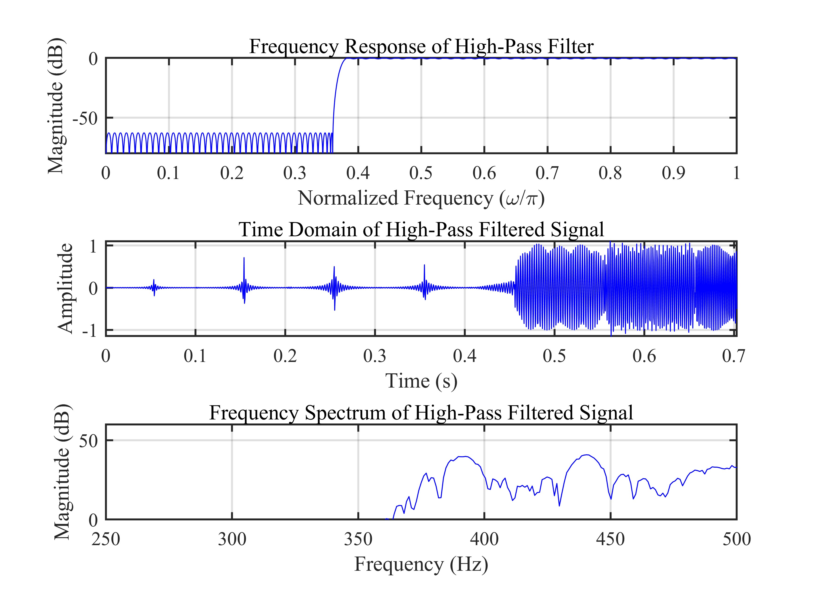
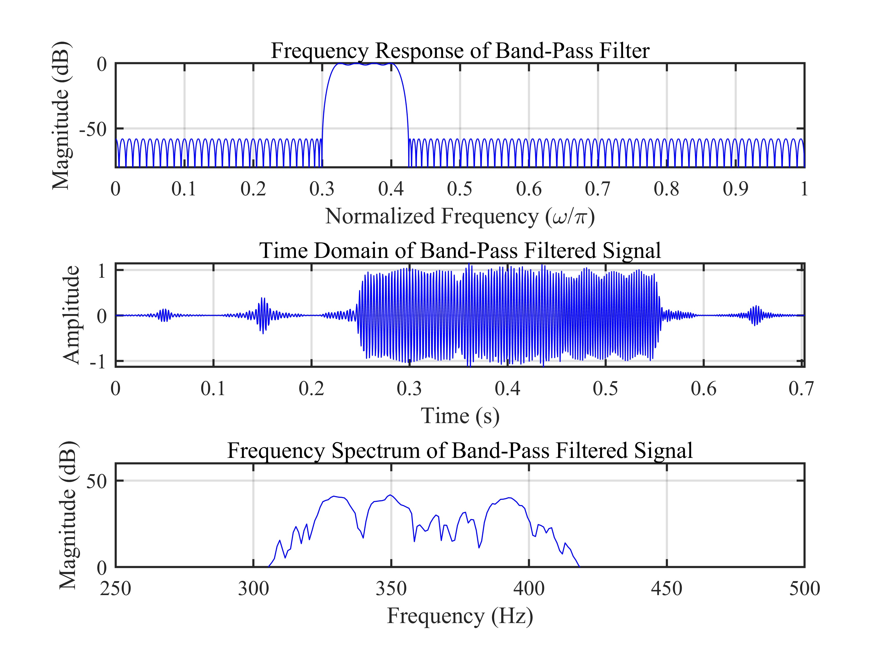
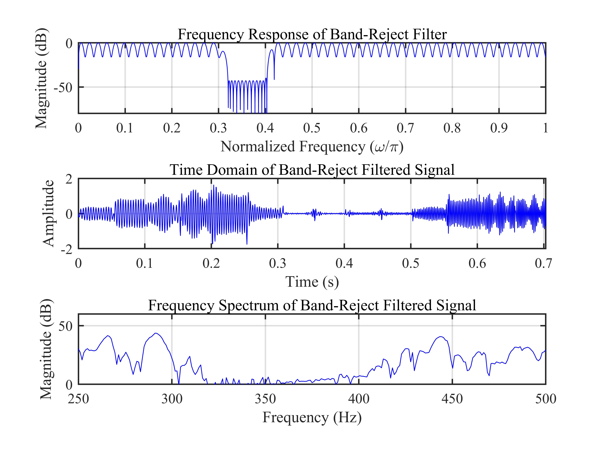

# 等波纹最佳逼近法 FIR 滤波器设计 / Equiripple FIR Filter Design

## 1. 原理概述 / Principle

等波纹最佳逼近法（Equiripple Optimum Approximation Method），也称为 Parks-McClellan 算法或 Remez 算法，是一种用于设计最优 FIR 滤波器的迭代方法。该方法以最小化通带和阻带内的最大逼近误差为目标，使误差在频带上均匀分布，形成等波纹特性。与窗函数法和频率采样法相比，等波纹设计能在相同滤波器阶数下获得更优的过渡带陡峭度和阻带衰减性能。

本项目的音频信号由 Do Re Mi Fa Sol La Si 七个音阶组成（频率范围 261.63–493.88 Hz），采样率为 2000 Hz。通过设计四种基本 FIR 滤波器（低通、高通、带通、带阻），对音频信号进行滤波处理，对比滤波前后的时域和频域变化，直观展示各类型滤波器的频率选择特性。

The Equiripple Optimum Approximation Method, also known as the Parks-McClellan algorithm or Remez algorithm, is an iterative approach for designing optimal FIR filters. It minimizes the maximum approximation error in both passband and stopband, distributing the error uniformly across the frequency bands to produce equiripple characteristics. Compared to windowing and frequency sampling methods, equiripple design achieves superior transition band steepness and stopband attenuation at the same filter order.

The audio signal in this project consists of seven musical notes Do Re Mi Fa Sol La Si (frequency range 261.63–493.88 Hz) sampled at 2000 Hz. Four basic FIR filter types (low-pass, high-pass, band-pass, band-reject) are applied to process the audio signal. By comparing the time-domain and frequency-domain changes before and after filtering, the frequency-selective characteristics of each filter type are intuitively demonstrated.

### 核心公式 / Core Equations

**FIR 滤波器频率响应 / FIR Filter Frequency Response:**

$$
H(e^{j\omega}) = \sum_{n=0}^{N-1} h[n] e^{-j\omega n}
$$

其中 $h[n]$ 为滤波器的单位冲激响应，$N$ 为滤波器阶数。

where $h[n]$ is the unit impulse response of the filter and $N$ is the filter order.

**Parks-McClellan 加权逼近误差 / Parks-McClellan Weighted Approximation Error:**

$$
E(\omega) = W(\omega)\bigl[H_d(\omega) - H(\omega)\bigr]
$$

其中 $W(\omega)$ 为加权函数，$H_d(\omega)$ 为理想频率响应，$H(\omega)$ 为实际频率响应。算法通过 Remez 交换迭代求解使最大加权误差最小化的最优系数。高通和带阻滤波器使用 `remez(Ne, fo, mo, W, 'h')` 指定希尔伯特变换类型以正确构造奇对称冲激响应。

where $W(\omega)$ is the weighting function, $H_d(\omega)$ is the desired frequency response, and $H(\omega)$ is the actual frequency response. The algorithm iteratively solves for the optimal coefficients that minimize the maximum weighted error using the Remez exchange algorithm. High-pass and band-reject filters use `remez(Ne, fo, mo, W, 'h')` to specify the Hilbert transform type for correct odd-symmetric impulse response construction.

---

## 2. 关键参数 / Key Parameters

| 参数 / Parameter | 符号 / Symbol | 典型值 / Value | 说明 / Description |
|------|------|------|------|
| 采样频率 | $f_s$ | 2000 Hz | 音频信号采样率 / Audio sampling rate |
| 每个音符时长 | $T$ | 0.10 s | 单个音符持续时间 / Duration per note |
| 通带最大衰减 | $A_p$ | 1 dB | 通带允许的最大衰减 / Max passband attenuation |
| 阻带最小衰减 | $A_s$ | 60 dB | 阻带要求的最小衰减 / Min stopband attenuation |
| 低通通带截止 | $f_{p,\text{LP}}$ | 335 Hz | 低通滤波器通带边缘 / LP passband edge |
| 低通阻带截止 | $f_{s,\text{LP}}$ | 340 Hz | 低通滤波器阻带边缘 / LP stopband edge |
| 高通阻带截止 | $f_{s,\text{HP}}$ | 360 Hz | 高通滤波器阻带边缘 / HP stopband edge |
| 高通通带截止 | $f_{p,\text{HP}}$ | 380 Hz | 高通滤波器通带边缘 / HP passband edge |
| 带通左阻带截止 | $f_{s1,\text{BP}}$ | 300 Hz | 带通左阻带边缘 / BP left stopband edge |
| 带通左通带截止 | $f_{p1,\text{BP}}$ | 320 Hz | 带通左通带边缘 / BP left passband edge |
| 带通右通带截止 | $f_{p2,\text{BP}}$ | 405 Hz | 带通右通带边缘 / BP right passband edge |
| 带通右阻带截止 | $f_{s2,\text{BP}}$ | 425 Hz | 带通右阻带边缘 / BP right stopband edge |
| 带阻左通带截止 | $f_{p1,\text{BR}}$ | 300 Hz | 带阻左通带边缘 / BR left passband edge |
| 带阻左阻带截止 | $f_{s1,\text{BR}}$ | 320 Hz | 带阻左阻带边缘 / BR left stopband edge |
| 带阻右阻带截止 | $f_{s2,\text{BR}}$ | 400 Hz | 带阻右阻带边缘 / BR right stopband edge |
| 带阻右通带截止 | $f_{p2,\text{BR}}$ | 420 Hz | 带阻右通带边缘 / BR right passband edge |

## 3. 仿真结果 / Simulation Results

> 以下仿真结果基于等波纹最佳逼近法设计的 4 种 FIR 滤波器，对包含 7 个音阶的音频信号分别进行滤波处理。滤波器阶数由 remezord 函数自动估算后加 1 确定。高通和带阻滤波器在 remez 中指定 `'h'` 类型标志以构造奇对称冲激响应。

### 3.1 各音符时域波形 / Time Domain of Individual Notes

> 七个音阶（Do Re Mi Fa Sol La Si）各自的时域波形，频率范围 261.63-493.88 Hz，采样率 2000 Hz，每音符时长 0.10 s

### 3.2 原始音频时域与频域 / Original Audio Time and Frequency Domain

> 原始音频信号时域波形和频域频谱（显示 250-500 Hz 范围），合并为统一视图

### 3.3 低通滤波结果 / Low-Pass Filtering Results

> 低通滤波器（通带截止 335 Hz，阻带截止 340 Hz）：滤波器响应、滤波后时域与频谱

### 3.4 高通滤波结果 / High-Pass Filtering Results

> 高通滤波器（阻带截止 360 Hz，通带截止 380 Hz）：滤波器响应、滤波后时域与频谱

### 3.5 带通滤波结果 / Band-Pass Filtering Results

> 带通滤波器（通带 320-405 Hz，左阻带 300 Hz，右阻带 425 Hz）：滤波器响应、滤波后时域与频谱

### 3.6 带阻滤波结果 / Band-Reject Filtering Results

> 带阻滤波器（阻带 320-400 Hz，左通带 300 Hz，右通带 420 Hz）：滤波器响应、滤波后时域与频谱

---

*更多算法请返回 [F:\GitHub](../../README.md).*
