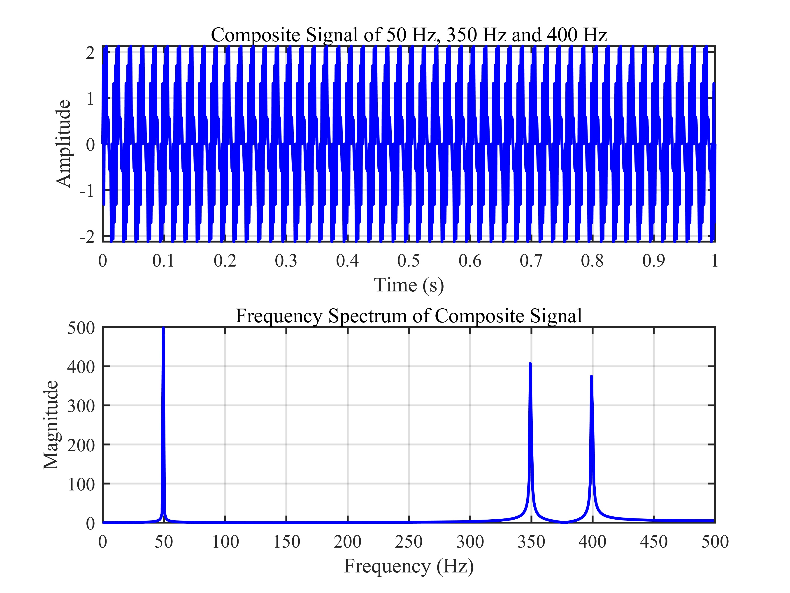
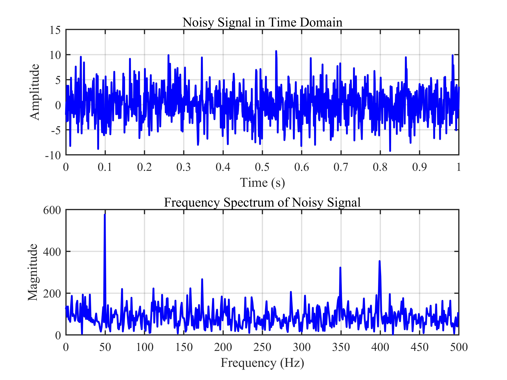
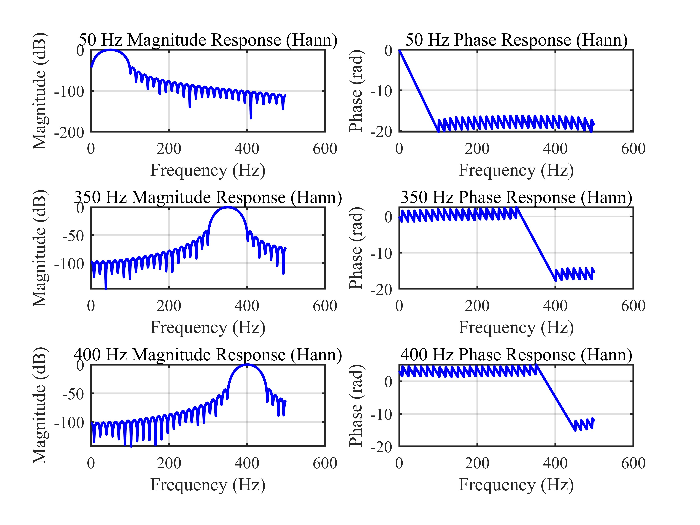
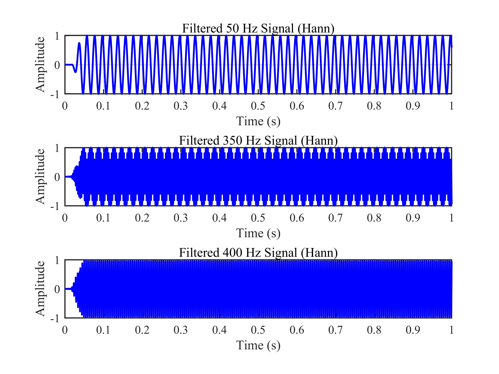
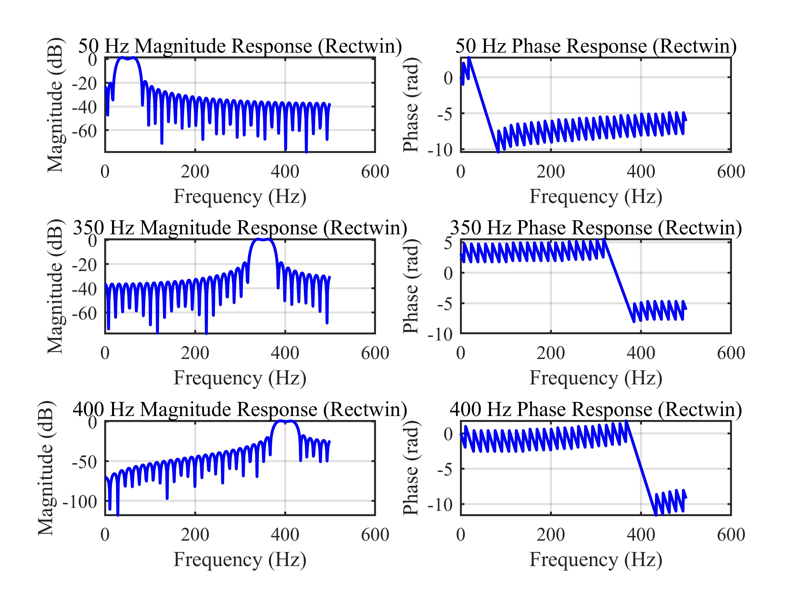

# 窗函数法 FIR 带通滤波器分离多频正弦信号 / Window-Based FIR Band-Pass Filter for Multi-Tone Signal Separation

## 1. 原理概述 / Principle

傅里叶变换是信号处理中最基本的分析工具之一，它揭示了信号在频域中的频率成分分布。本项目通过 MATLAB 对由 50 Hz、350 Hz 和 400 Hz 三个正弦分量合成的信号进行傅里叶变换，分析其幅频特性，并利用窗函数法（汉宁窗和矩形窗）设计 FIR 带通滤波器，将三个频率分量从合成信号中分离出来。

窗函数法是 FIR 滤波器设计中最简单直观的方法。其基本原理是对理想带通滤波器的无限长冲激响应施加一个有限长的窗函数截断，得到可实现的有限长滤波器系数。不同的窗函数在旁瓣衰减和过渡带宽度之间有不同的折中：矩形窗具有最窄的主瓣（最陡的过渡带）但旁瓣衰减最小（约 -13 dB），而汉宁窗通过平滑的窗形状获得更大的旁瓣衰减（约 -44 dB）但主瓣宽度加倍。

Fourier transform is a fundamental tool in signal processing that reveals the frequency composition of a signal. This project applies Fourier transform to a composite signal consisting of 50 Hz, 350 Hz, and 400 Hz sinusoidal components, analyzes its frequency spectrum, and designs window-based FIR band-pass filters (Hanning and rectangular windows) to separate the three frequency components.

The window method is the simplest and most intuitive approach for FIR filter design. Its basic principle is to truncate the infinite-length impulse response of an ideal band-pass filter using a finite-length window function, yielding a realizable finite-length filter. Different window functions offer different trade-offs between sidelobe attenuation and transition bandwidth: the rectangular window has the narrowest main lobe (steepest transition) but the smallest sidelobe attenuation (approx. -13 dB), while the Hanning window achieves greater sidelobe attenuation (approx. -44 dB) at the cost of double the main lobe width.

### 核心公式 / Core Equations

**离散傅里叶变换 / Discrete Fourier Transform (DFT):**

$$
X[k] = \sum_{n=0}^{N-1} x[n] e^{-j 2\pi k n / N}
$$

其中 $x[n]$ 为时域信号，$N$ 为信号长度，$X[k]$ 为频域表示。

where $x[n]$ is the time-domain signal, $N$ is the signal length, and $X[k]$ is the frequency-domain representation.

**FIR 带通滤波器系数 / FIR Band-Pass Filter Coefficients:**

$$
h[n] = h_{\text{ideal}}[n] \cdot w[n]
$$

$$
h_{\text{ideal}}[n] = \frac{\sin(\omega_c n)}{\pi n}
$$

其中 $w[n]$ 为窗函数（汉宁窗或矩形窗），$h_{\text{ideal}}[n]$ 为理想带通滤波器的冲激响应，$\omega_c$ 为通带中心频率。

where $w[n]$ is the window function (Hanning or rectangular), $h_{\text{ideal}}[n]$ is the impulse response of the ideal band-pass filter, and $\omega_c$ is the center frequency of the passband.

---

## 2. 关键参数 / Key Parameters

| 参数 / Parameter | 符号 / Symbol | 典型值 / Value | 说明 / Description |
|------|------|------|------|
| 采样频率 | $f_s$ | 1000 Hz | 信号采样率 / Signal sampling rate |
| 信号时长 | $T$ | 1.0 s | 总信号持续时间 / Total signal duration |
| 滤波器阶数 | $N$ | 64 | FIR 滤波器阶数 / FIR filter order |
| FFT 点数 | $N_{\text{fft}}$ | 512 | 频率响应计算点数 / Freq response points |
| 噪声幅度 | $\sigma_n$ | 3 | 高斯白噪声标准差 / Gaussian noise std |
| 信号 1 频率 | $f_1$ | 50 Hz | 第一个正弦分量 / First sine component |
| 信号 2 频率 | $f_2$ | 350 Hz | 第二个正弦分量 / Second sine component |
| 信号 3 频率 | $f_3$ | 400 Hz | 第三个正弦分量 / Third sine component |
| 50 Hz 滤波通带 | $f_{\text{bp},1}$ | 25-75 Hz | 信号 1 带通范围 / BP range for signal 1 |
| 350 Hz 滤波通带 | $f_{\text{bp},2}$ | 325-375 Hz | 信号 2 带通范围 / BP range for signal 2 |
| 400 Hz 滤波通带 | $f_{\text{bp},3}$ | 375-425 Hz | 信号 3 带通范围 / BP range for signal 3 |

## 3. 仿真结果 / Simulation Results

> 以下仿真结果展示了从合成信号生成到 FIR 带通滤波器分离的完整流程。使用汉宁窗和矩形窗两种方法分别进行滤波，对比两种窗函数的滤波效果。

### 3.1 各频率分量时域波形 / Time Domain of Individual Components

> 50 Hz、350 Hz、400 Hz 三个正弦信号分别的时域波形

### 3.2 合成信号的时域与频域 / Composite Signal Time and Frequency Domain

> 三个正弦分量合成后的信号时域波形（上图）及其 FFT 幅频特性（下图，显示 0-500 Hz 范围），可见三个清晰的谱峰

### 3.3 加噪信号的时域与频域 / Noisy Signal Time and Frequency Domain

> 添加高斯白噪声（标准差为 3）后的信号时域波形（上图）及其 FFT 幅频特性（下图）

### 3.4 汉宁窗滤波结果 / Hanning Window Filtering Results

> 使用汉宁窗设计的 FIR 带通滤波器，分别分离三个频率分量。左侧为各通带的幅频响应（dB），右侧为对应的相频响应（弧度）

> 汉宁窗滤波后分离出的三个正弦信号时域波形

### 3.5 矩形窗滤波结果 / Rectangular Window Filtering Results

> 使用矩形窗设计的 FIR 带通滤波器，分别分离三个频率分量。左侧为各通带的幅频响应（dB），右侧为对应的相频响应（弧度）

> 矩形窗滤波后分离出的三个正弦信号时域波形

---

*更多算法请返回 [F:\GitHub](../../README.md).*
